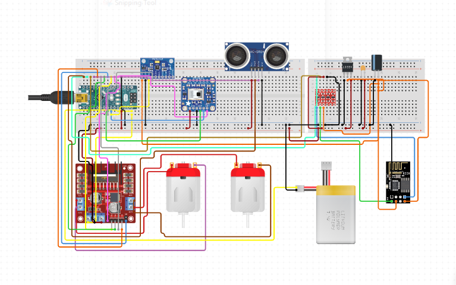
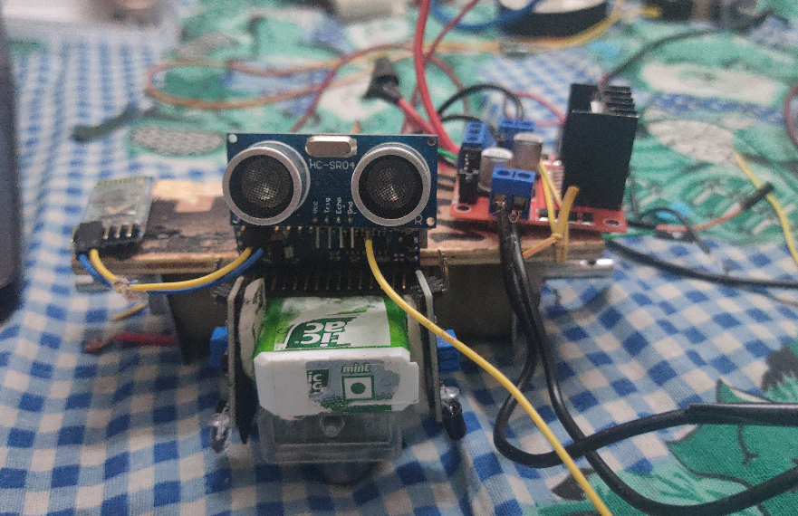
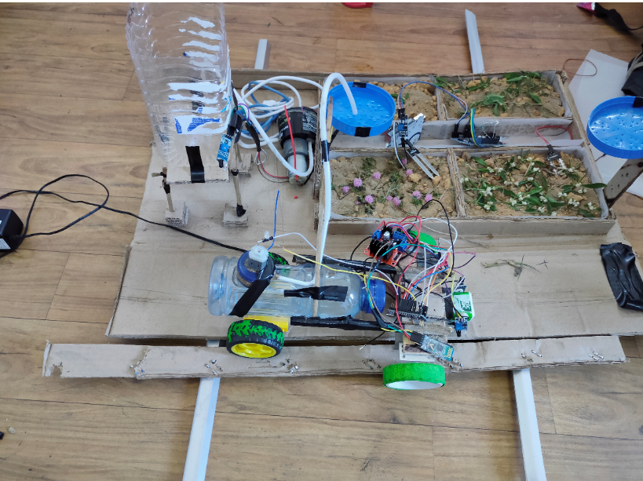

# RT-Farm
## A project for hackathon; LinCode
###  Phase 1:Virtual Simulation of Proposed bot Idea :    Status: COMPLETE   
###  Phase 2: Construction of the hardware part          Status: COMPLETE  
###  Phase 3: Writing of Scripts                         Status: COMPLETE  
###  Phase 4: Incorporating ML models                   Status: Under Development  
  
## Complete Working has been discussed

 Circuit Diagram is
 
 

Some Images of the bot:

